Tutorial
========

This tutorial covers the basic steps of going froma dataset to visualizing SOM and data using the SOM Analyst toolbox for ArcGIS 9.3. This process is the same basic process that would be applied to any dataset.

Connecting the Folder
---------------------

Adding the Toolbox
------------------

1. Open the ArcToolbox panel by clicking on the **Window** menu and select **ArcToolbox**. Alternatively, click on the toolbox icon on the meun bar.

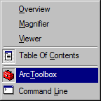

2. Right click in the ArcToolbox panel and select **Add Toolbox...**.

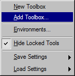

3. Browse to the location of SOM Analyst and select **guiArcGIS93.tbx** and click **Open**.

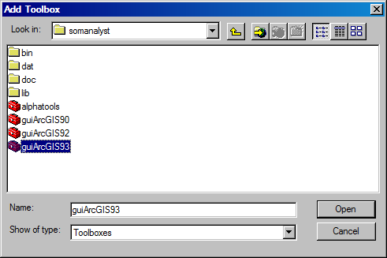

.. note:: Double click on a toolbox opens it as a folder and allows you to add toolboxes it contains.

The SOM Analyst toolbox is now acessible throught the ArcToolbox panel.

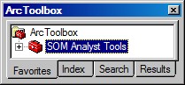

Browse through the toolbox to familarize your self with the tools.

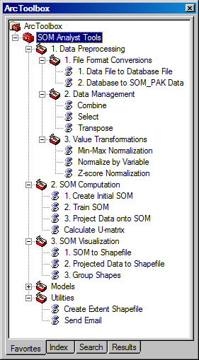

Convert Data Format
-------------------

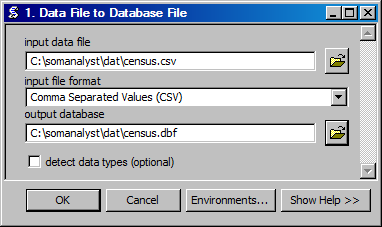

.. image:: ../../_images/tutorial/census.png

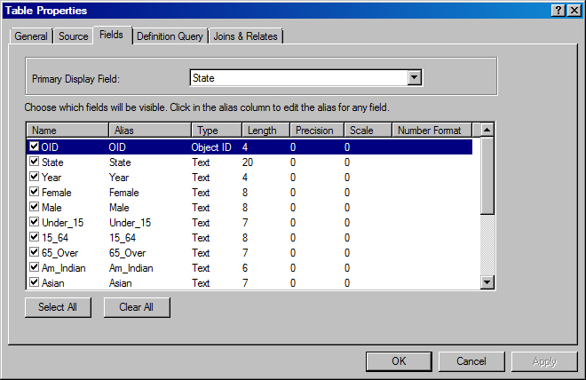

Select Variables
----------------

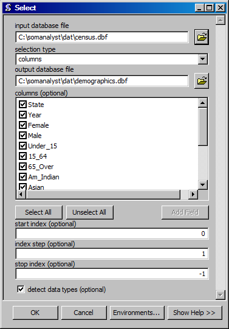

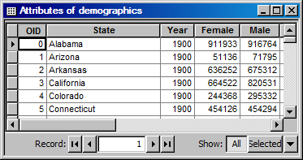

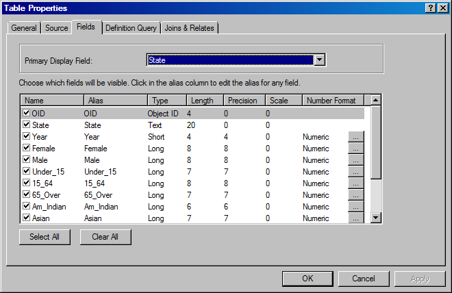

Normalize Data
--------------

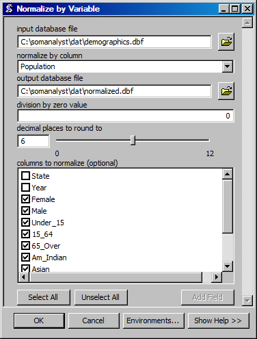

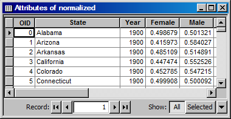

Delete the population field.

.. image:: ../../_images/tutorial/Zscore.png

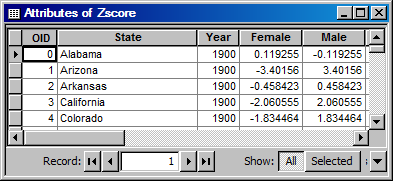

Export Data
-----------

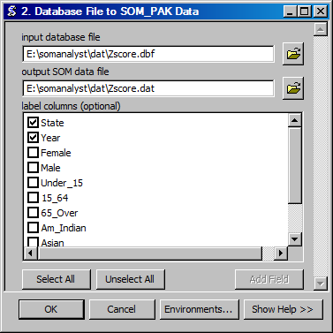

Create Initial SOM
------------------

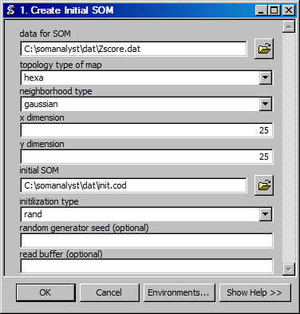

.. image:: ../../_images/tutorial/training.png

Train SOM
---------

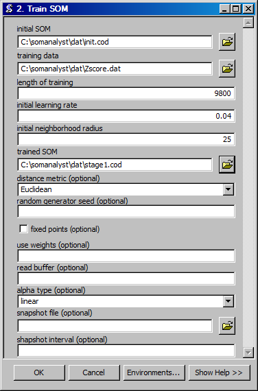

.. image:: ../../_images/tutorial/stage2.png

Project Data onto SOM
---------------------

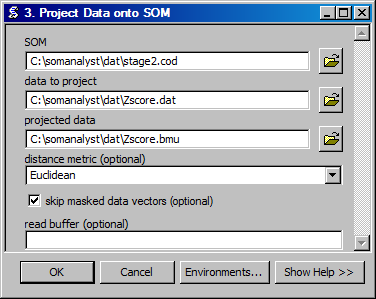

Create SOM Shapefile
--------------------

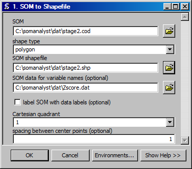

Create Data Shapefile
---------------------

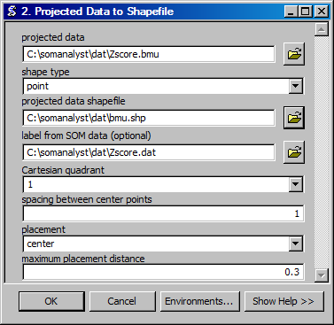

Group Data Shapefile
--------------------

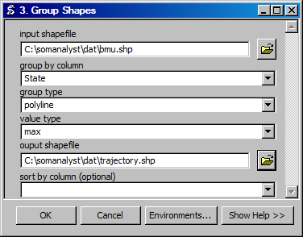

Visualization
-------------