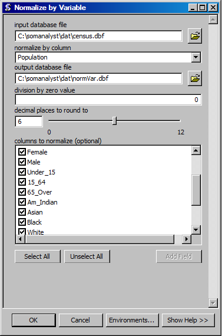

Tutorial
========

This tutorial contains step-by-step instrucitons on how to use the provided example dataset with SOM Analyst. The data is converted from the comma separated file format to the database file format so that normalizations can be performed. The data is then normalized by state population and then normalized from 0 to 1 before exporting the data for use with a SOM. A SOM is trained in two stages with this data, which is then projected onto the SOM and visualized. The resulting visualization shows the relative changes between gender, age, and race in each state during each U.S. census in the 20th century. 

.. note:: The data for this tutorial is provided with SOM Analyst and is located in its sub-folder named **dat** . 

Adding the Toolbox
------------------

Add the SOM Analyst Toolbox to ArcGIS.

1. Open the ArcToolbox panel by clicking on the **Window** menu and select **ArcToolbox**. Alternatively, click on the toolbox icon on the menu bar.

.. figure:: ../../_images/ArcToolbox.png

2. Right click in the ArcToolbox panel and select **Add Toolbox...**.

.. figure:: ../../_images/AddToolbox.png

3. Browse to the location of SOM Analyst and select **guiArcGIS93.tbx** and click **Open**.

.. note:: Depending on your computer setup, it may be necessary to "connect" to the folder conatain SOM Analyst. On the menu bar click on the icon of a folder with an arrow pointing to a globe.

.. note:: Double clicking on a toolbox opens it as a folder and allows you to add toolboxes it contains.

The SOM Analyst toolbox is now acessible throught the ArcToolbox panel.

.. figure:: ../../_images/SOManalyst.png

Browse through the toolbox to familarize your self with the tools.

.. figure:: ../../_images/ToolList.png

Convert Data Format
-------------------

Convert the data to a database file format.

1. Run the **Data File to Database File** tool by double clicking on it in the **File Format Conversions** toolbox of the **Data Preprocessing** toolbox.

.. figure:: ../../_images/toXbase.png

2. Select **census.csv** as the *input data file*.

3. Set **Comma Separated Values (CSV)** as the *input file format*. 

4. Set **census.dbf** as the *output database file*.

5. Click **OK** to run the conversion.

In the table properties the data type for each column is text.

The values in the table are left justified indicating that they are text.

.. figure:: ../../_images/census.png

Normalize Data
--------------

Normalize values in the database file.

1. Run the **Normalize by Variable** tool by double clicking on it in the **Value Transformations** toolbox of the **Data Preprocessing** toolbox.

2. Select **census.dbf** as the *input database file*.

3. Select **Population** as the *normalize by column*.

4. Set **normVar.dbf** as the *output database file*.

5. Select the columns **male**, **female**, **Under_15**, **15_64**, **65_Over**, **Am_Indian**, **Asian**, **Black**, and **White** in the *columns to normalize* field.

6. Click **OK** to run the normalization.

The resulting table contains population ratios.

.. figure:: ../../_images/normalizevalues.png

7. Run the **Min-Max Normalization** tool by double clicking on it in the **Value Transformations** toolbox of the **Data Preprocessing** toolbox.

.. figure:: ../../_images/norm01.PNG

8. Select **normVar.dbf** as the *input database file*.

9. Select **column** as the *normalize by* field.

10. Set **norm01.dbf** as the *output database file*.

11. Select the columns **male**, **female**, **Under_15**, **15_64**, **65_Over**, **Am_Indian**, **Asian**, **Black**, and **White** in the *columns to normalize* field.

12. Click **OK** to run the normalization.

The resulting table contains normalized values.

.. figure:: ../../_images/norm01values.PNG

Select Variables
----------------

Select the relevant variables from the database file.

1. Run the **Select** tool by double clicking on it in the **Data Management** toolbox of the **Data Preprocessing** toolbox.

.. figure:: ../../_images/select.png

2. Select **norm01.dbf** as the *input database file*.

3. Set **columns** as the *selection type*.

4. Set **demographics.dbf** as the *output database file*.

5. Select all columns except **Owner**, **Renter**, and **Households** in the *columns* field.

6. Enable **detect data types**.

7. Click **OK** to run the selection.

In table properties the value types for the columns has changed where appropriate. 

The numeric values in the table are right justified indicating that they are numbers.

.. figure:: ../../_images/demographics.png

.. note:: Detecting data types for columns requires checking the data type of each value and can be time consuming for large datasets. This  step is only necessary if performing normalizations or other calculations before using the data with a SOM.

Export Data
-----------

Export the database file to the SOM data format.

1. Run the **Database File to SOM_PAK Data** tool by double clicking on it in the **File Format Conversions** toolbox of the **Data Preprocessing** toolbox.

.. figure:: ../../_images/somdat.png

2. Select **demographics.dbf** as the *input database file*.

3. Set **demographics.dat** as the *ouput SOM data file*. 

4. Select **Region**, **Division**, **State**, and **Year** in the *label columns* field.

5. Click **OK** to run the export.

Create Initial SOM
------------------

Creating the intitial SOM.

1. Run the **Create Initial SOM** tool by double clicking on it in the **SOM Computation** toolbox.

.. figure:: ../../_images/mapinit.png

2. Select **demographics.dat** as the *data for SOM*.

3. Select **hexa** as the *topology of map*.

4. Set **25** as the *x dimension*.

5. Set **25** as the *y dimension*.

6. Set **init.cod** as the *initial SOM*.

7. Click **OK** to run the creation of the intial SOM.

A window will open that indicates the progress of the process.

.. figure:: ../../_images/training.png

Train SOM
---------

Training the SOM. 

.. note:: The SOM will be trained in two steps. The first training will create the overall structure in the SOM. The second training will create the finer specialization.

1. Run the **Train SOM** tool by double clicking on it in the **SOM Computation** toolbox.

.. figure:: ../../_images/stage1.png

2. Select **init.cod** as the *inital som*.

3. Select **demographics.dat** as the *training data*.

4. Set **4900** as the *length of training*.

5. Set **0.04** as the *inital learning rate*.

6. Set **25** as the *inital neighborhood radius*.

7. Set **stage1.cod** as the *trained SOM*.

8. Click **OK** to run the training of the SOM.

A window will open that indicates the progress of the process as it did with the creation of the inital SOM.

9. Run the **Train SOM** tool.

.. figure:: ../../_images/stage2.png

10. Select **stage1.cod** as the *inital som*.

11. Select **demographics.dat** as the *training data*.

12. Set **49000** as the *length of training*.

13. Set **0.03** as the *inital learning rate*.

14. Set **5** as the *inital neighborhood radius*.

15. Set **stage2.cod** as the *trained SOM*.

16. Click **OK** to run the training of the SOM.

Calculate U-Matrix
------------------

Calculate the U-matrix of a SOM.

1. Run the **Calculate U-matrix** tool by double clicking on it in the **SOM Computation** toolbox.

.. figure:: ../../_images/umatrix.png

2. Select **stage2.cod** as the *input SOM*.

3. Set **Umatrix.dbf** as the *ouput U-matrix database file*.

4. Click **OK** to calculate the U-matrix

.. figure:: ../../_images/umatrix.png

Project Data onto SOM
---------------------

Project the data onto the SOM.

1. Run the **Project Data onto SOM** tool by double clicking on it in the **SOM Computation** toolbox.

.. figure:: ../../_images/bmu.png

2. Select **stage2.cod** as the *SOM*.

3. Select **demographics.dat** as the *data to project*.

4. Set **demographics.bmu** as the *projected data*.

5. Click **OK** to project the data onto the SOM.

A window will open that indicates the progress of the process as it did with the creation of the inital SOM.

Create SOM Shapefile
--------------------

Creating the SOM shapefile.

1. Run the **SOM to Shapefile** tool by double clicking on it in the **SOM Visualization** toolbox.

.. figure:: ../../_images/somshape.png

2. Select **stage2.cod** as the *SOM*.

3. Select **polygon** as the *shape type*.

4. Set **stage2.shp** as the *SOM shapefile*.

5. Set **demographics.dat** as the *SOM data for variable names*.

6. Set **umatrix.dbf** as the *U-matrix*.

7. Click **OK** to create the SOM shapefile.

Create Data Shapefile
---------------------

Creating the data shapefile.

1. Run the **Projected Data to Shapefile** tool by double clicking on it in the **SOM Visualization** toolbox.

.. figure:: ../../_images/bmushape.png

2. Select **Zscore.bmu** as the *projected data*.

3. Select **point** as the *shape type*.

4. Set **bmu.shp** as the *projected data shapefile*.

5. Select **demographics.dat** as the *label from SOM data*.

6. Click **OK** to create the data shapefile.

Group Data Shapefile
--------------------

Grouping the shapes in the data shapefile

1. Run the **Group Shapes** tool by double clicking on it in the **SOM Visualization** toolbox.

.. figure:: ../../_images/trajectory.png

2. Select **bmu.shp** as the *input shapefile*.

3. Select **State** as the *group by column*

4. Select **polyline** as the *group type*.

5. Select **max** as the *value type*.

6. Set **trajectory.shp** as the *output shapefile*.

Visualization
-------------

Visualizing the SOM and projected data.

1. Open **tutorial.mxd**.

.. figure:: ../../_images/tutorial.png

The large map shows the trajectory of each state across the SOM over time with a base of the U-matrix, a measure of distortion. The trajectories are color coded by census division, which are shown in the lower right. The other frames show the component plane, the value for one variable across the entire SOM.

.. note:: Your map will not be identical, but should be very similar. The frames may appear rotated due to the inital random number used.