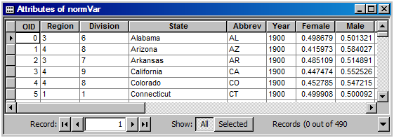
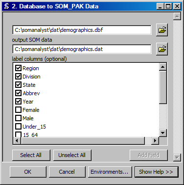
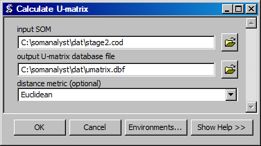

Tutorial
========

This tutorial contains step-by-step instructions on how to use the provided example dataset with SOM Analyst in ArcMap. The source data set for this tutorial is provided with SOM Analyst and is located in its sub-folder named **dat**. The file named **census.csv** contains gender, age, race, and housing data for each U.S. population census between the years 1900 and 1990.

First, the data is converted from the comma separated file format (.csv) to the database file format (.dbf) so that normalizations can be performed. Second, the raw count data are normalized by state population counts. Third, every variable is normalized into a 0 to 1 range and the preprocessed data are then exported to the SOM input format. Using those input data, a SOM is trained in two stages. The input data are then projected onto the finished SOM. Finally, a number of visualizations are produced.
 
System Requirements
-------------------
#. Windows (any version)
#. ArcGIS 9.3 (legacy toolboxes for ArcGIS 9.0-9.2 are provided, but untested)
#. Python 2.5 (included in the default ArcGIS 9.3 installation)

Download
--------
SOM Analyst is available for download from http://somanalyst.googlecode.com

Adding the Toolbox
------------------

Add the SOM Analyst Toolbox to ArcGIS.

1. Open the ArcToolbox panel by clicking on the **Window** menu and select **ArcToolbox**. Alternatively, click on the toolbox icon on the menu bar.

2. Right click in the ArcToolbox panel and select **Add Toolbox...**.

3. Browse to the location of SOM Analyst and select **guiArcGIS93.tbx** and click **Open**.

.. note:: Depending on your computer setup, it may be necessary to first "connect" to the folder that contains SOM Analyst. In that case, click in the dialog box on the icon of a folder with an arrow pointing to a globe.

.. figure:: ../../_images/guiArcGIS93.png

The SOM Analyst toolbox is now accessible through the ArcToolbox panel.

Browse through the toolbox to familiarize yourself with the tools.

.. figure:: ../../_images/ToolList.png

Convert Data Format
-------------------

Convert the data to a database file format.

1. Run the **Data File to Database File** tool by double clicking on it in the **File Format Conversions** toolbox of the **Data Preprocessing** toolbox.

.. figure:: ../../_images/toXbase.png

2. Select **census.csv** as the *input data file*.

3. Set **Comma Separated Values (CSV)** as the *input file format*. 

4. Change the *output database file* to **census.dbf**.

5. Click **OK** to run the conversion.

In the table properties the data type for each column is text.

.. figure:: ../../_images/censusfields.png

The values in the table are left justified indicating that they are text.

.. figure:: ../../_images/census.png

Normalize Data
--------------

Normalize values in the database file.

1. Run the **Normalize by Variable** tool by double clicking on it in the **Value Transformations** toolbox of the **Data Preprocessing** toolbox.

.. figure:: ../../_images/normalize.png

2. Select **census.dbf** as the *input database file*.

3. Select **Population** as the *normalize by column*.

4. Change the *output database file* to **census.dbf**.

5. Select the columns **male**, **female**, **Under_15**, **15_64**, **65_Over**, **Am_Indian**, **Asian**, **Black**, and **White** in the *columns to normalize* field.

6. Click **OK** to run the normalization.

The resulting table contains population ratios.

7. Run the **Min-Max Normalization** tool by double clicking on it in the **Value Transformations** toolbox of the **Data Preprocessing** toolbox.

.. figure:: ../../_images/norm01.PNG

8. Select **normVar.dbf** as the *input database file*.

9. Select **column** as the *normalize by* field.

10. Change the *output database file* to **norm01.dbf**.

11. Select the columns **male**, **female**, **Under_15**, **15_64**, **65_Over**, **Am_Indian**, **Asian**, **Black**, and **White** in the *columns to normalize* field.

12. Click **OK** to run the normalization.

The resulting table contains normalized values.

.. figure:: ../../_images/norm01values.PNG

Select Variables
----------------

Select the relevant variables from the database file.

1. Run the **Select** tool by double clicking on it in the **Data Management** toolbox of the **Data Preprocessing** toolbox.

.. figure:: ../../_images/select.png

2. Select **norm01.dbf** as the *input database file*.

3. Set **columns** as the *selection type*.

4. Change the *output database file* to **demographics.dbf**.

5. Select all columns except **Population**, **Owner**, **Renter**, and **Households** in the *columns* field.

6. Enable **detect data types**.

7. Click **OK** to run the selection.

In table properties the value types for the columns has changed where appropriate. 

.. figure:: ../../_images/demographicfields.png

The numeric values in the table are right justified indicating that they are numbers.

.. figure:: ../../_images/demographics.png

.. note:: Detecting data types for columns requires checking the data type of each value and can be time consuming for large datasets. This  step is only necessary if performing normalizations or other calculations before using the data with a SOM.

Export Data
-----------

Export the database file to the SOM data format.

1. Run the **Database File to SOM_PAK Data** tool by double clicking on it in the **File Format Conversions** toolbox of the **Data Preprocessing** toolbox.

2. Select **demographics.dbf** as the *input database file*.

3. Change the *output SOM data file* to **demographics.dat**. 

4. Select **Region**, **Division**, **State**, and **Year** in the *label columns* field.

5. Click **OK** to run the export.

Create Initial SOM
------------------

Creating the initial SOM.

1. Run the **Create Initial SOM** tool by double clicking on it in the **SOM Computation** toolbox.

.. figure:: ../../_images/mapinit.png

2. Select **demographics.dat** as the *data for SOM*.

3. Select **hexa** as the *topology of map*.

4. Set **25** as the *x dimension*.

5. Set **25** as the *y dimension*.

6. Set **init.cod** as the *initial SOM*.

7. Click **OK** to run the creation of the initial SOM.

A window will open that indicates the progress of the process.

.. figure:: ../../_images/training.png

Train SOM
---------

Training the SOM. 

.. note:: The SOM will be trained in two steps. The first training will create the overall structure in the SOM. The second training will create the finer specialization.

1. Run the **Train SOM** tool by double clicking on it in the **SOM Computation** toolbox.

.. figure:: ../../_images/stage1.png

2. Select **init.cod** as the *initial som*.

3. Select **demographics.dat** as the *training data*.

4. Set **4900** as the *length of training*.

5. Set **0.04** as the *initial learning rate*.

6. Set **25** as the *initial neighborhood radius*.

7. Change the *trained SOM* to **stage1.cod**.

8. Click **OK** to run the training of the SOM.

A window will open that indicates the progress of the process as it did with the creation of the initial SOM.

9. Run the **Train SOM** tool.

.. figure:: ../../_images/stage2.png

10. Select **stage1.cod** as the *initial som*.

11. Select **demographics.dat** as the *training data*.

12. Set **49000** as the *length of training*.

13. Set **0.03** as the *initial learning rate*.

14. Set **5** as the *initial neighborhood radius*.

15. Change the *trained SOM* to **stage2.cod**.

16. Click **OK** to run the training of the SOM.

Calculate U-Matrix
------------------

Calculate the U-matrix of a SOM.

1. Run the **Calculate U-matrix** tool by double clicking on it in the **SOM Computation** toolbox.

2. Select **stage2.cod** as the *input SOM*.

3. Change the *output U-matrix database file* to **Umatrix.dbf**.

4. Click **OK** to calculate the U-matrix

Project Data onto SOM
---------------------

Project the data onto the SOM.

1. Run the **Project Data onto SOM** tool by double clicking on it in the **SOM Computation** toolbox.

.. figure:: ../../_images/bmu.png

2. Select **stage2.cod** as the *SOM*.

3. Select **demographics.dat** as the *data to project*.

4. Change the *projected data* to **demographics.bmu**.

5. Click **OK** to project the data onto the SOM.

A window will open that indicates the progress of the process as it did with the creation of the initial SOM.

Create SOM Shapefile
--------------------

Creating the SOM shapefile.

1. Run the **SOM to Shapefile** tool by double clicking on it in the **SOM Visualization** toolbox.

.. figure:: ../../_images/somshape.png

2. Select **stage2.cod** as the *SOM*.

3. Select **polygon** as the *shape type*.

4. Change the *SOM shapefile* to **stage2.shp**.

5. Set **demographics.dat** as the *SOM data for variable names*.

6. Enable *label SOM with data labels*

7. Set **Umatrix.dbf** as the *U-matrix*.

8. Click **OK** to create the SOM shapefile.

Create Data Shapefile
---------------------

Creating the data shapefile.

1. Run the **Projected Data to Shapefile** tool by double clicking on it in the **SOM Visualization** toolbox.

.. figure:: ../../_images/bmushape.png

2. Select **demographics.bmu** as the *projected data*.

3. Select **point** as the *shape type*.

4. Change the *projected data shapefile* to **bmu.shp**.

5. Select **demographics.dat** as the *label from SOM data*.

6. Select **random around center** as the *placement*.

7. Click **OK** to create the data shapefile.

Group Data Shapefile
--------------------

Grouping the shapes in the data shapefile.

1. Run the **Group Shapes** tool by double clicking on it in the **SOM Visualization** toolbox.

.. figure:: ../../_images/trajectory.png

2. Select **bmu.shp** as the *input shapefile*.

3. Select **State** as the *group by column*

4. Select **polyline** as the *group type*.

5. Select **maximum** as the *value type*.

6. Change the *output shapefile* to **trajectories.shp**.

7. Select **Year** as the *sort by column*.

8. Click **OK** to create the trajectories.

Create Extent Shapefile
-----------------------

Creating the extent shapefile.

1. Run the **Create Extent Shapefile** tool by double clicking on it in the **Utilities** toolbox.

2. Select **stage2.shp** as the *input shapefile*.

3. Change the *output shapefile* to **extent.shp**.

4. Click **OK** to create the extent shapefile.

Visualization
-------------

Visualizing the SOM and projected data.

1. Open **tutorial.mxd**.

.. note:: Your map will not be identical, but should be very similar. The frames may appear rotated due to the initial random numbers used.

.. figure:: ../../_images/tutorial.png

The large map shows the trajectory of each state across the SOM over time with a base of the U-matrix, a measure of distortion. The trajectories are color coded by census division, which are shown in the lower right. The other frames contain the component planes, each showing the neuron weights for one variable across the entire SOM.

When examining the demographic trajectories of each state note that each shift in the trajectory corresponds to a census year and that at the end of the trajectory is an arrow that represents the year 1990. Parallel trajectories indicate a similar change in demographics over time. Parallel trajectories are particularly evident within the South Division (West South Central Region, East South Central Region, and South Atlantic Region) and Northeast Division (Middle Atlantic Region and New England Region). This demonstrates spatial autocorrelation and is consistent with the demographic changes over the last century. In the Northeast Division, the parallel trajectories split 40 years ago mainly into coastal and land locked areas with New York and New Jersey similar to each other, but dissimilar to the other coastal states.

When examining component planes you are seeing how the SOM allocates location based on that variable. In this map, darker color means high values and lighter color means low values. You can see that the female component plane is very dark in one corner and light in the opposite corner with a gradual change between the two. Conversely the male component plane is very dark in the opposite corner and has a similar pattern of gradual change. When comparing component planes to each other you can see how the SOM weights the variables in the same location and thus derive a relationship between them. You can see that that female and male have an inversely proportional relationship in the SOM that corresponds with reality, that is that a high number of females inherently means a low number of males and vice versa.

