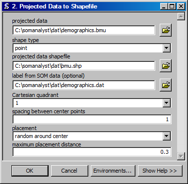

Best Matching Unit to Shapefile
==================================
Creates a shapefile from projected data.

ArcGIS Reference
----------------

**Parameters**

projected data
  The input projected data file.
shape type
  The type of shapes to use to represent the data.
projected data shapefile
  The output shapefile to contain the projected data shapes.
label from SOM data
  The unprojected SOM data file that contains the values and labels to use for the projected data.
Cartesian quadrant
  The Cartesian quadrant in which to place the shapes.
spacing between center points
  The spacing between the units in the SOM on which the projected data will be displayed.
placement
  The placement location on each SOM unit to use for the projected data shapes.
maximum placement distance
  The maximum distance from the center of the SOM units to place the projected data shapes.

Code Reference
--------------

.. automodule:: uiBMUtoSHP
   :members:
   :undoc-members:
