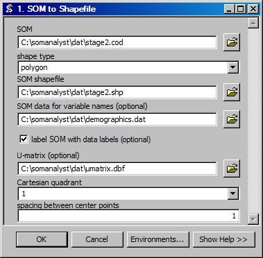

SOM to Shapefile
==================================
Creates a shapefile from a SOM codebook file.

ArcGIS Reference
----------------

**Parameters**

SOM
  The input SOM codebook file from which to create a shapefile.
shape type
  The type of shapes to use for the SOM.
SOM shapefile
  The output shapefile.
SOM data for variable names
  The data that contains the variable names.
label SOM with data labels
  Label the SOM with the values from data that is the best match.
Cartesian quadrant
  The Cartesian coordinatein which  to place the SOM.
spacing between center points
  The distance between the ceneter points of units in the SOM.

Code Reference
--------------

.. automodule:: uiCODtoSHP
   :members:
   :undoc-members:
