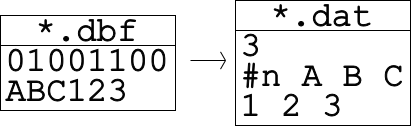

Database File to SOM Data File
==================================
Creates a SOM data file from a database file.

ArcGIS Reference
----------------

.. figure:: ../../_images/somdat.png

**Parameters**

input database file
  The input database data file.
output SOM data file
  The output SOM data in the SOM_PAK format.
label columns
  An optional mode that treats selected columns as labels.

Code Reference
--------------

.. automodule:: uiDBFtoDAT
   :members:
   :undoc-members:
