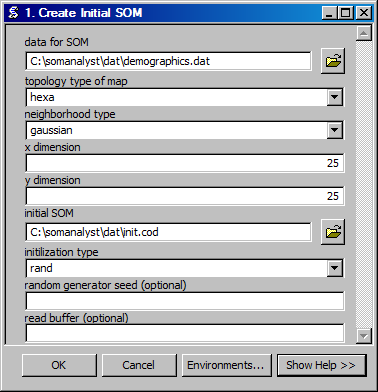

.. index::
   single: SOM; create
   single: codebook; create

Create Initial SOM
==================================
Creates an initial SOM codebook file.

ArcGIS Reference
----------------

**Parameters**

data for SOM
  The input data for the SOM. Need to determine the number of dimensions, and if using linear (lin) initialization the appropriate seed values.
topology type of map
  The topology (geometry) of the self-organizing map. Hexagonal (hexa) has been preselected because the center points are all equidistant. Rectangular (rect) has a horizontal and vertical bias because diagonals are farther apart.
neighborhood type
  The type of neighborhood or relationship between units in the SOM. Gaussian is selected by default, because it is most typical.
x dimension
  The number of units of the SOM along the X axis.
y dimension
  The number of units in the SOM along the Y axis.
initial SOM
  The ouput file for the intial SOM.
initilization type
  The initialization type to use for the some. Random (rand) has been selected, because it is more consistent with the method of self-organization, however linear (lin) will produce results more quickly.
random generator seed
  The seed to use for the random number generator, by default the current time is used.
read buffer
  The number of data lines to read at a time.

Code Reference
--------------

.. automodule:: uiMapInit
   :members:
   :undoc-members:
