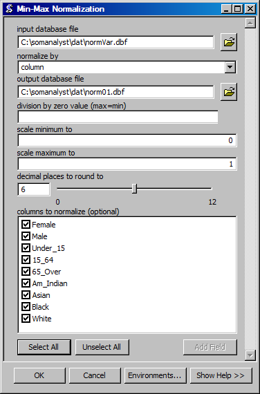

Minimum-Maximum Normalization
==================================
Creates a databasefile with values normalized from a minimum value to a maximum value.

ArcGIS Reference
----------------

**Parameters**

input database file
  The input database file with the data to normalize.
normalize by
  The direction in the table to perform the normailzation.
output database file
  The output database file that will contain the normalized data.
division by zero value (max=min)
  The value to assign when the resulting normalization requires a division by zero, as is the case when the minimum is also the maximum.
scale minimum to
  The minimum value for the normalized data.
scale maximum to
  The maximum value for the normalized data.
decimal places to round to
  The number of places to round the normalized data to.
columns to normalize
  The columns to normalize. If no columns are selected normalization will be performed on all columns that are numeric.

Code Reference
--------------

.. automodule:: uiNormMinMax
   :members:
   :undoc-members:
