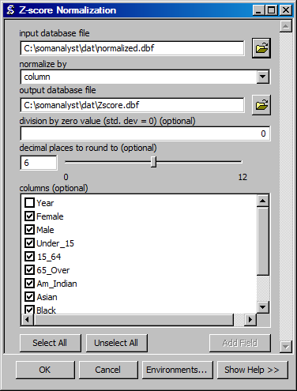

Z-Score Normalization
==================================
Creates a database file with Z-score values.

ArcGIS Reference
----------------

**Parameters**

input database file
  The input database file.
normalize by
  The column by which to normalize data.
output database file
  The output database file.
division by zero value (std. dev = 0)
  The value to assign if there is a division by zero.
decimal places to round to
  The number of decimal places to which to round numbers.
columns
  The columns to normalize. If no columns are selected, all columns will be normalized.

Code Reference
--------------

.. automodule:: uiNormZ
   :members:
   :undoc-members:
