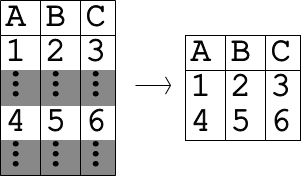

Select Data
==================================
Creates a database file with the selected values.

ArcGIS Reference
----------------

.. figure:: ../../_images/select.png

**Parameters**

input database file
  
selection type
  The way in which data will be selected.
output database file
  The output databse file.
columns
  The columns to include in the data selection.
start index
  The index from which to begin the selection.
index step
  The increment from the start index for the next selection.
stop index
  The index at which to stop selection. Negative indicies are equivalent of indexing from the end.
detect data types
  An optional mode that automatically changes the data types in a column based on the values it contains. This mode is usueful if the data will be processed further using  mathmatical operations.

Code Reference
--------------

.. automodule:: uiSelect
   :members:
   :undoc-members:
