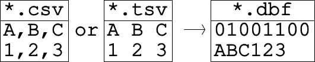
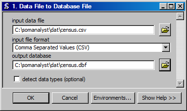

Conversion to Database File
==================================
Converts various data file formats to the database file format.

ArcGIS Reference
----------------

**Parameters**

input data file
  The input data file.
input file format
  The input file format.
output database file
  The output database file.
detect data types
  An optional mode that automatically detects the data type in a column.

Code Reference
--------------

.. automodule:: uiToXbase
   :members:
   :undoc-members:
