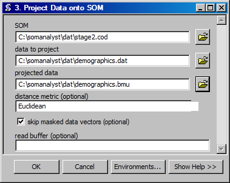

Calculate Best Matching Units
==================================
Creates a best matching unit file by projecting data onto a SOM.

ArcGIS Reference
----------------

**Parameters**

SOM
  The SOM on which to project data.
data to project
  The data to project onto the SOM.
projected data
  The ouput file to contain the projected data.
distance metric
  The distance metric to use in projecting the data.
skip masked data vectors
  Skip vectors that have been masked. Masking is done by begining vectors with a "x", but this is not reccomended since SOM Analyst in several instances does matching based on line number.
read buffer
  The number of lines to read at a time.

Code Reference
--------------

.. automodule:: uiVisual
   :members:
   :undoc-members:
