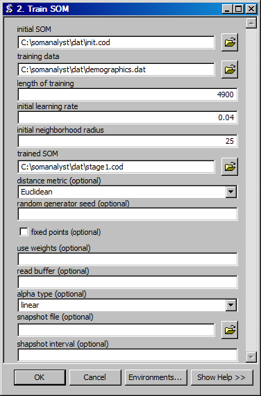

Train SOM
==================================
Trains a SOM.

ArcGIS Reference
----------------

**Parameters**

initial SOM
  The initial SOM to train.
training data
  The data with which to train the SOM.
length of training
  The length of training as measured by the total number of individual data row exposures.
initial learning rate
  The initial learing rate for the SOM.
initial neighborhood radius
  The initial distance over which a neighborhood is defined.
trained SOM
  The ouput trained SOM.
distance metric
  The distance metric to use when training the SOM. The Euclidean distance metric uses SOM_PAK as released from the Helsinki University of Technology. The Cosine distance metric uses SOM_PAK as modified by Fareed Qaddoura.
random generator seed
  The seed for the random number generator, by default the current time is used.
fixed points
  Use fixed point qualifiers in the training.
use weights
  Use weighting qualifiers in the training.
read buffer
  The number of lines to read at a time.
alpha type
  The learning rate function type. Linear (linear) is defined as initial alpha * [1 - (current training step/run length)]. Inverse-time (inverse_t) is defined as initial alpha * [(run length/100)/((run length/100)+current training step)].
snapshot file
  A series of files to contain the intermediate SOMs. If the name contains %d the current step number will used in the file name.
shapshot interval
  The interval at which to take the snapshots.

Code Reference
--------------

.. automodule:: uiVsom
   :members:
   :undoc-members:
